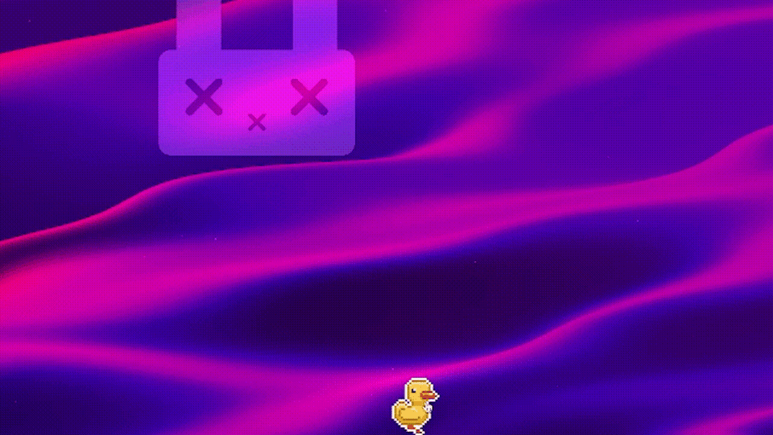
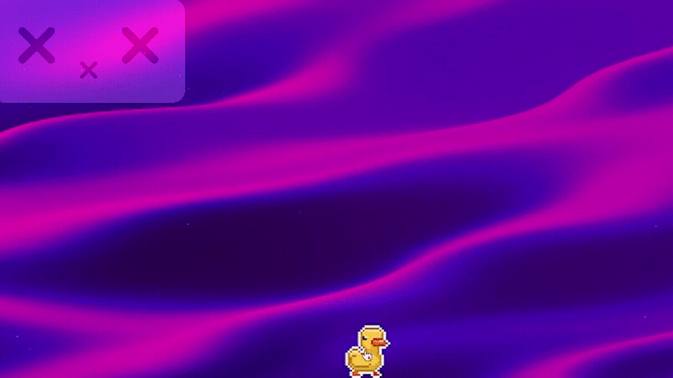
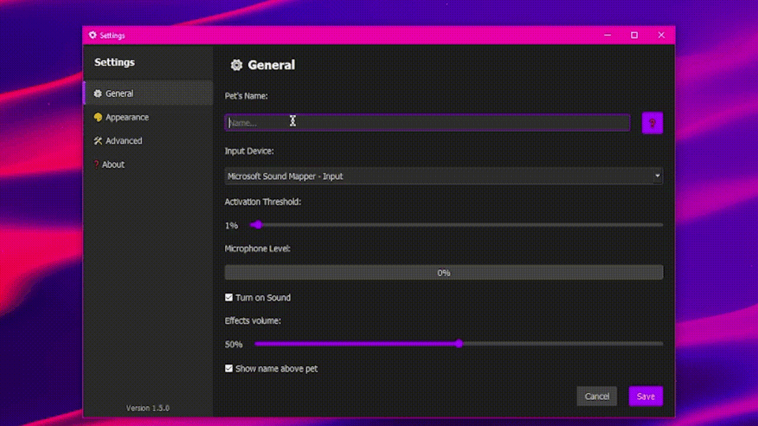

# QuackDuck 🦆 - Interactive Virtual Pet

QuackDuck is an interactive virtual pet duck developed in Python using PyQt5. The application offers a variety of skins, animations, and sound effects, providing an engaging and personalized experience for each user.

## 🚀 Key Features

- Diverse Skins: Choose from a wide range of available skins or create your own. Skins can be stored in any directory, and users can specify the path through the settings menu.
- Interactive Animations: The pet responds to user actions, changes states, and performs various animations.
- Sound Effects: Play random sounds and respond to audio signals.
- Multi-language Support: The interface is available in English and Russian.
- Logging: A logging system to track events and errors.
- Settings: Flexible configuration of pet parameters through an intuitive interface.
- Build via Releases: Executable .exe files are provided in the [Releases](https://github.com/KristopherZlo/quackduck/releases) section.
- State System: The pet can be in various states such as walking, sleeping, playing, and more.
- Microphone Integration: The pet reacts to sound signals using the microphone.

## 📥 Download

Download the latest version of QuackDuck from the [Releases](https://github.com/KristopherZlo/quackduck/releases) section.

## 📸 Screenshots

## 🤝 Participation

If you have suggestions or questions, you can create an [Issue](https://github.com/KristopherZlo/quackduck/issues) in the repository.

## 📝 License

This project is protected by copyright. All rights are reserved. Distribution and use of the code without the author's written permission are strictly prohibited.

## 📚 Additional Information

### Logging

The application saves logs to the quackduck_crash.log file located in the user's home directory:

- Windows: C:\Users\<Username>\quackduck_crash.log
- Linux: /home/<Username>/quackduck_crash.log
- macOS: Good luck getting this running on macOS

### Translations

Translation files are located in the languages folder and are loaded dynamically based on the selected language.

### Skins

Skins are stored in any user-selected directory. To add new skins:

1. Place the corresponding .zip files in the chosen directory.
2. Open the settings menu in the application.
3. Specify the path to the skins directory.

## Support the Developer

If you enjoy QuackDuck and want to support its development, you can buy me a coffee:

---

*Thank you for using QuackDuck! 🦆💖*